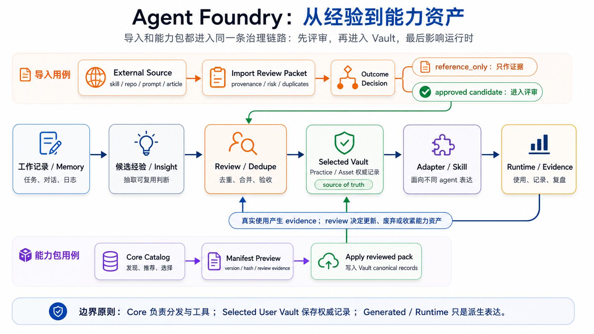

# Agent Foundry

Agent Foundry is a local-first system for turning real work experience into reusable, reviewable, deployable agent capabilities across Codex, ChatGPT, Claude Code, Hermes, and similar environments.

## Why This Exists

AI agents can generate useful insights while working, but insight is not the same as durable capability. A good lesson from one session can disappear into chat history, stay trapped in one agent's memory, or become a vague rule that future agents do not actually follow.

Agent Foundry exists to govern that transformation:

```text
work session
  -> insight
  -> canonical practice or reusable asset
  -> human approval
  -> agent-specific adapter
  -> runtime use
  -> usage evidence
  -> review and improvement
```

The goal is not to maintain a pile of prompts. The goal is to make hard-won working judgment portable across sessions, agents, machines, and projects without losing human review or source-of-truth discipline.

For the motivation and collaboration philosophy behind this project, see [docs/philosophy.md](docs/philosophy.md).

**中文要点：** 项目的动机和人-agent 协作反思主要写在 [docs/philosophy.md](docs/philosophy.md)。

## What It Does

Agent Foundry keeps Core tooling, User Vault records, and runtime delivery separate.



- Core contains workflows, schemas, scripts, templates, docs, adapter profiles, and validation tools.
- A User Vault contains canonical practices, reusable assets, indexes, imports, and sanitized usage aggregates.
- `adapters/`: downstream outputs for specific agent environments.
- Runtime installs under agent-specific home directories are downstream copies.

Agent memory, session summaries, and external skills are treated as evidence sources. They can suggest candidates, but they do not become durable rules until reviewed.

## Repository Map

| Path | Purpose |
| --- | --- |
| `workflows/` | Procedures agents should follow for harvest, import, review, publish, and sync. |
| `schemas/` | Canonical record shapes and validation rules. |
| `scripts/` | Deterministic tooling for checks, install, sync, evidence, and review. |
| `templates/` | Blank practice, asset, and import templates for Vault records. |
| `adapters/` | Adapter profiles and tracked distribution outputs. |
| `runtime/` | Machine-local deployment manifests and portable runtime templates. |
| `sync/` | Portable sync templates and ignored local sync state. |
| `docs/` | Human-readable philosophy, usage, design, deployment, and compatibility notes. |

Vault-owned paths such as `practices/`, `assets/`, `indexes/`, `imports/`, and `usage/usage-aggregate.yaml` live in the selected User Vault, not in the clean public Core checkout.

## Quick Start

Run these from the Agent Foundry Core checkout on a new machine:

```bash
cd "/path/to/agent-foundry"
python3 scripts/init_vault.py ~/.agent-foundry/vault/my-agent-foundry-vault --core-root . --apply
python3 scripts/foundry_config.py write --core-root . --vault-root ~/.agent-foundry/vault/my-agent-foundry-vault
python3 scripts/foundry_config.py status
python3 scripts/runtime_manifest.py init
python3 scripts/runtime_manifest.py detect
python3 scripts/runtime_manifest.py plan
```

The locator step writes `~/.agent-foundry/config.yaml`. Agents working in other repositories use that locator to find both the Core checkout and the selected User Vault.

For full install, adding or removing agents, and offline/online sync, see [docs/deployment.md](docs/deployment.md).

## Daily Use

Use short commands instead of remembering internal workflows:

| Command | Purpose |
| --- | --- |
| `refresh practices and assets` | Pull updates, regenerate adapters if needed, and install to enabled local runtimes. |
| `harvest practices` | Extract reusable lessons from a work session. |
| `discover assets` | Find repeated workflows worth packaging as a skill, subagent, automation, or extension. |
| `review practices` | Check for stale rules, duplicates, weak activation, adapter drift, and skill rot. |

Detailed prompts and Chinese equivalents are in [docs/usage.md](docs/usage.md) and [docs/commands.md](docs/commands.md).

## Optional Starter Packs

After the first-value path above works, you can ask Agent Foundry to list or
preview optional first-party starter packs. They are not required setup choices.

**中文要点：** Starter packs 是 first-value path 之后的可选项，不是新用户必须先做的安装选择。

| Pack | What you get | Choose it when |
| --- | --- | --- |
| `pack.bootstrap.minimal` | A small baseline for safe harvest, review, refresh, status, source-of-truth boundaries, and external-skill import/reference review. | Accept it for a new selected Vault or before any optional pack; it does not install runtimes or publish generated adapters by itself. |
| `pack.multi-agent.optional` | GitHub issue/PR collaboration habits: role labels, durable comments, Execution Contracts, Tester evidence routing, collaboration readiness, and action-plan guidance. | Install it when you coordinate work through GitHub issues and PRs; skip it for solo local usage or projects without GitHub collaboration. |

**中文要点：** `pack.bootstrap.minimal` 是最小基础包；`pack.multi-agent.optional`
适合需要 GitHub issue/PR 协作、Tester evidence、collaboration readiness 和 action plan 的项目。

Use Skill-facing requests first: `list capability packs`, `recommend capability packs for my setup`, `preview capability pack deployment <pack-path>`, `apply reviewed capability pack <pack-path>`, `verify capability pack <pack-id>`, `update capability pack <pack-id-or-path>`, and `disable capability pack <pack-id>`.

Architecture-boundary and source-of-truth orientation is folded into `pack.bootstrap.minimal`.

Core catalog entries make packs discoverable, but the selected User Vault remains canonical after accepted deployment. Generated adapters, runtime installs, local receipts, and Local Private evidence remain downstream or excluded surfaces.

**中文要点：** architecture-boundary guidance 由 `pack.bootstrap.minimal` 承载；accepted deployment 后 selected User Vault 仍是 canonical，Generated/Runtime 只是 downstream surfaces。

For ordinary and complete details, see [docs/usage.md](docs/usage.md), [docs/commands.md](docs/commands.md), and the catalog pages under `catalog/capability-packs/`.

**中文要点：** 完整细节见 [docs/usage.md](docs/usage.md)、[docs/commands.md](docs/commands.md)，以及 `catalog/capability-packs/` 下的 catalog pages。

## Design Principles

- The repository is the canonical source of truth.
- Runtime files under `~/.codex`, `~/.claude`, `~/.hermes`, and similar locations are downstream copies.
- Agent memory is evidence, not authority.
- Human approval gates durable practices and assets.
- Adapters should preserve meaning while respecting each agent's native instruction mechanics.
- The smallest maintainable mechanism is preferred over heavier machinery.

See [docs/system-design.md](docs/system-design.md) and [docs/lifecycle-compatibility.md](docs/lifecycle-compatibility.md).

## Supported Targets

| Target | Status |
| --- | --- |
| Codex | Local `SKILL.md` adapter. |
| Claude Code | `CLAUDE.md` and related adapter files. |
| Hermes | Local `SKILL.md` adapter. |
| ChatGPT | Manual import through custom/project instructions and knowledge files. |

DeepSeek, MiniMax, and similar model providers are treated as underlying models used through programming agents, not direct Agent Foundry adapters.

## Documentation

- [Philosophy](docs/philosophy.md): why this project exists.
- [Usage](docs/usage.md): day-to-day commands and prompts.
- [Multi-Agent Collaboration](docs/multi-agent-collaboration.md): role-based issue/PR development flow, including Tester gates.
- [Deployment](docs/deployment.md): fresh install, runtime changes, sync, and offline operation.
- [System Design](docs/system-design.md): architecture, boundaries, lifecycle, and governance model.
- [Roadmap](docs/roadmap.md): productization, repository hygiene, and memory-system readiness plan.
- [Lifecycle Compatibility](docs/lifecycle-compatibility.md): how the full loop maps across agent systems.
- [Offline Sync](docs/offline-sync.md): snapshot and remote sync strategy.
- [Standards and Sources](docs/standards-and-sources.md): external conventions and adapter standards.
- [Memory System Handoff Dump](docs/memory-system-handoff-dump.md): preserved discussion evidence for a proposed future memory/knowledge subsystem; not current implemented architecture.
