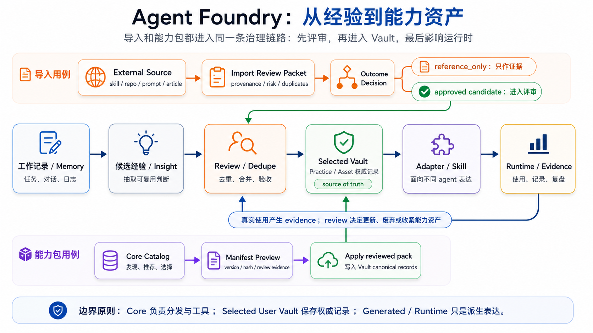

# Agent Foundry

Agent Foundry is a local-first system for turning real work experience into reusable, reviewable, deployable agent capabilities across Codex, ChatGPT, Claude Code, Hermes, and similar environments.

## Why This Exists

AI agents can generate useful insights while working, but insight is not the same as durable capability. A good lesson from one session can disappear into chat history, stay trapped in one agent's memory, or become a vague rule that future agents do not actually follow.

Agent Foundry exists to govern that transformation:

```text
work session
  -> insight
  -> canonical practice or reusable asset
  -> human approval
  -> agent-specific adapter
  -> runtime use
  -> usage evidence
  -> review and improvement
```

The goal is not to maintain a pile of prompts. The goal is to make hard-won working judgment portable across sessions, agents, machines, and projects without losing human review or source-of-truth discipline.

在开发的过程中最重要的收获是做了很多思考和反思，有关人和agent的协作，都写进了这篇文档： [docs/philosophy.md](docs/philosophy.md).

## What It Does

Agent Foundry keeps Core tooling, User Vault records, and runtime delivery separate.



- Core contains workflows, schemas, scripts, templates, docs, adapter profiles, and validation tools.
- A User Vault contains canonical practices, reusable assets, indexes, imports, and sanitized usage aggregates.
- `adapters/`: downstream outputs for specific agent environments.
- Runtime installs under agent-specific home directories are downstream copies.

Agent memory, session summaries, and external skills are treated as evidence sources. They can suggest candidates, but they do not become durable rules until reviewed.

## Start Local Collaboration

For a new or existing project, the supported collaboration front door is
**“开启本地多-agent协作”** / **“start local collaboration”**. It uses the
SQLite-backed local authority and its owner APIs for a single machine: read-only
onboarding and status first, one explicitly approved local action when needed,
then fresh owner readback and owner-guided recovery. The optional Board is a
read-only view, not a second authority and not a GitHub Project writer.

| Capability | Current boundary |
| --- | --- |
| Single-machine onboarding, status and recovery | `available` in accepted Core/integration evidence; not a production release claim. |
| Idempotent owner-guided local actions | `available` behind the relevant Human decision and fresh readback. |
| A0-Lite manual custody between isolated authorities on one host | `experimental_same_host_manual_custody`. |
| Real second device, cross-host transport, device-loss resilience, independent credentials or convergence | `held_real_second_device_deferred`. |

Start with [the local collaboration lifecycle](workflows/local-collaboration-lifecycle.md),
then use [the collaboration guide](docs/multi-agent-collaboration.md) for roles
and durable GitHub evidence. JSONL/V2 trial commands elsewhere in this repository
are historical, compatibility, export, or diagnostic material—not a normal
onboarding path, a fallback authority, a migration requirement, or a dual-write
store.

## Repository Map

| Path | Purpose |
| --- | --- |
| `workflows/` | Procedures agents should follow for harvest, import, review, publish, and sync. |
| `schemas/` | Canonical record shapes and validation rules. |
| `scripts/` | Deterministic tooling for checks, install, sync, evidence, and review. |
| `templates/` | Blank practice, asset, and import templates for Vault records. |
| `adapters/` | Adapter profiles and tracked distribution outputs. |
| `runtime/` | Machine-local deployment manifests and portable runtime templates. |
| `sync/` | Portable sync templates and ignored local sync state. |
| `docs/` | Human-readable philosophy, usage, design, deployment, and compatibility notes. |

Vault-owned paths such as `practices/`, `assets/`, `indexes/`, `imports/`, and `usage/usage-aggregate.yaml` live in the selected User Vault, not in the clean public Core checkout.

## Supported Targets

| Target | Status |
| --- | --- |
| Codex | Local `SKILL.md` adapter. |
| Claude Code | `CLAUDE.md` and related adapter files. |
| Hermes | Local `SKILL.md` adapter. |
| ChatGPT | Manual import through custom/project instructions and knowledge files. |

DeepSeek, MiniMax, and similar model providers are treated as underlying models used through programming agents, not direct Agent Foundry adapters.

## Quick Start

新工作站请直接阅读并交给 agent 执行 [canonical Fresh Install runbook](docs/deployment.md#fresh-install)。它从使用者自己的 blank/selected Vault 开始，串联 starter packs、reviewed optional activation、Generated publish、runtime dry-run/apply 和逐层 readback，并明确三个真正需要 Human 决策的节点。不要从 README、pack README 和脚本源码自行拼接第二套安装流程。

## Daily Use

Use short commands instead of remembering internal workflows:

| Command | Purpose |
| --- | --- |
| `refresh practices and assets` | Pull updates, regenerate adapters if needed, and install to enabled local runtimes. |
| `harvest practices` | Extract reusable lessons from a work session. |
| `discover assets` | Find repeated workflows worth packaging as a skill, subagent, automation, or extension. |
| `review practices` | Check for stale rules, duplicates, weak activation, adapter drift, and skill rot. |

Detailed prompts and Chinese equivalents are in [docs/usage.md](docs/usage.md) and [docs/commands.md](docs/commands.md).

## Recommended Starter Packs

For a new Agent Foundry setup, install these two first-party capability packs after the Core/Vault locator and status checks work.

| Pack | Why install it |
| --- | --- |
| `pack.bootstrap.minimal` | Gives the selected User Vault the minimal reviewed baseline for safe harvest, review, refresh, status, source-of-truth boundaries, and external-skill import/reference review. Install this first. |
| `pack.multi-agent.optional` | Adds GitHub issue/PR collaboration habits: role labels, durable handoffs, Execution Contracts, Tester evidence routing, collaboration readiness audit, and safe action-plan guidance. Install this when you coordinate work through GitHub. |

完整、可执行且可恢复的 starter-pack 顺序只维护在 [Fresh Install runbook](docs/deployment.md#fresh-install)。Optional members import as `proposed`, not automatically active；activation、Generated publish 和 Runtime install 是三个不同边界。

For full capability-pack behavior, see [docs/usage.md](docs/usage.md), [docs/commands.md](docs/commands.md), and the catalog pages under `catalog/capability-packs/`.

## Design Principles

- The repository is the canonical source of truth.
- Runtime files under `~/.codex`, `~/.claude`, `~/.hermes`, and similar locations are downstream copies.
- Agent memory is evidence, not authority.
- Human approval gates durable practices and assets.
- Adapters should preserve meaning while respecting each agent's native instruction mechanics.
- The smallest maintainable mechanism is preferred over heavier machinery.

See [docs/system-design.md](docs/system-design.md) and [docs/lifecycle-compatibility.md](docs/lifecycle-compatibility.md).

## Documentation

- [Philosophy](docs/philosophy.md): why this project exists.
- [Usage](docs/usage.md): day-to-day commands and prompts.
- [Multi-Agent Collaboration](docs/multi-agent-collaboration.md): role-based issue/PR development flow, including Tester gates.
- [Deployment](docs/deployment.md): fresh install, runtime changes, sync, and offline operation.
- [System Design](docs/system-design.md): architecture, boundaries, lifecycle, and governance model.
- [Roadmap](docs/roadmap.md): productization, repository hygiene, and memory-system readiness plan.
- [Lifecycle Compatibility](docs/lifecycle-compatibility.md): how the full loop maps across agent systems.
- [Offline Sync](docs/offline-sync.md): snapshot and remote sync strategy.
- [v2.0.0 Candidate](docs/v2.0.0-candidate.md): evidence, usable boundaries, and remaining release gates.
- [Standards and Sources](docs/standards-and-sources.md): external conventions and adapter standards.
- [Memory System Handoff Dump](docs/memory-system-handoff-dump.md): preserved discussion evidence for a proposed future memory/knowledge subsystem; not current implemented architecture.
